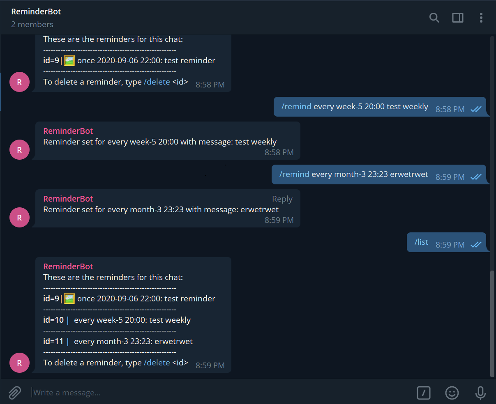

# Telegram Reminder Bot

This telegram bot is written and hosted on [Google App Script](https://www.script.google.com). The reminders are written as a time based trigger on google app script.

The bot works in both personal chats as well as group chats.

Note that all reminders can be seen by the person implementing the reminder bot. Do not store any reminders that contain any sort of private information. The only secure way to store private reminders is to host your own reminder bot on Google AppScript.

The default timezone of this bot is GMT+8, and is editable on the Utils.gs script.

## Available Bot Commands:

1. [/start](#Displaying-Introduction-Message)
2. [/help](#Displaying-Introduction-Message)
3. [/remind](#Setting-Reminders)
4. [/list](#Listing-all-reminders)
5. [/delete](#Deleting-reminders)

## Displaying Introduction Message

Typing /start or /help to the telegram bot displays an introduction message detailing the available commands for this bot.


## Setting Reminders

### One time reminders

To set a one time reminder, use the following syntax:

```
/remind once <YYYY-MM-DD> <HH:MM> <message>
E.g. /remind once 2020-10-01 16:15 Pay bills!
```

### Repeat Reminders

To set a repeat reminder, use the following syntax:

```
/remind every <frequency> <HH:MM> <message>
```

Examples:

```
/remind every day 08:00 Go swimming.
/remind every week-5 18:00 Friday drinks!
/remind every month-1 12:00 Pay Phone Bills!
```

Accepted frequencies are:

* day
* week-x
  * where x is the day of the week ranging from 1(Mon) to 7(Sun).
* month-x
  * where x is the day of the month. If month is set to 31, reminders will be sent on the 1st of the following month for months with less than 31 days.

Users can also type "/remind" to the bot for the reminder syntax:


### Reminder with images

The bot can send reminders along with an image if you send the reminder message along with an attached image.


### Reminder Text Formatting

The reminder text is parsed in html format, so the following special characters that would have to be escapped to be valid:

* '<' to '\&lt;'
* '>' to '\&gt;'
* '&' to '\&amp;'

See more information at https://core.telegram.org/bots/api#html-style


## Listing all reminders

The bot keeps a list of reminders for each unique chat that it has access to.
Type "/remind" to list all reminders for the specific chat.
Each reminder contains their specific reminder id, frequency, time, and the reminder message.

Reminders with images attached will have a &#128444; icon beside the id number as well.



## Deleting reminders

To delete a reminder, type /delete \<reminder-id> into the chat.

The reminder id can be seen from the /list command.


## Error checking

The bot does some error checking regarding reminders:

1. Checking if user is attempting to set reminders in the past
2. Repeat reminders dates that are out of bounds. (e.g. invalid day of the week or invalid day of the month)
3. Invalid parsing of the reminder text

## How to use

In order to host the code on google app script, the following tokens are required:

* bot token
  * Click [here](https://www.siteguarding.com/en/how-to-get-telegram-bot-api-token) to figure out how to get a bot token from the botfather.
* google spreadsheet id
  * A spreadsheet ID can be extracted from its URL. For
    example, the spreadsheet ID in the URL `https://docs.google.com/spreadsheets/d/abc1234567/edit#gid=0` is "abc1234567".
* google appscript webapp url
  * The web app url is available when you first deploy your google appscript project as web app

Steps to host on Google App Scripts:

1. Clone this repo
2. Create a new [Google App Script project](https://www.script.google.com)
3. Copy paste the code from the repo onto the project by creating 3 .gs files with the same name
4. Replace the token, webapp url and ssId variable with your own ones
5. Run the setWebHook() function to set the bot web hook to your webApp URL
6. Deploy the code as a web app

